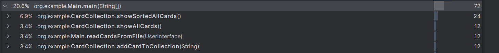
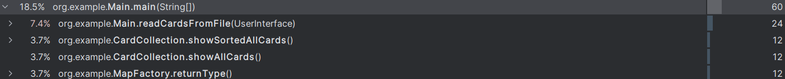
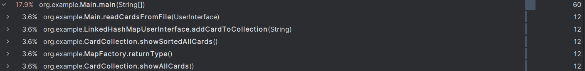

# Complejidad implementación HashMap para leer todas las cartas

La complejidad del método showAllCards() en la clase CardCollection que trabaja con HashMaps es lineal, con una complejidad de tiempo de **O(n)**, donde n representa el número de cartas en el HashMap allCards. Esto se debe a que el método itera a través de todas las cartas, realizando una operación básica por cada una, que en este caso es imprimir el nombre y tipo de cada carta.

# Profiler
### Implementación HashMap

### Implementación TreeMap

### Implementación LinkedHashMap

